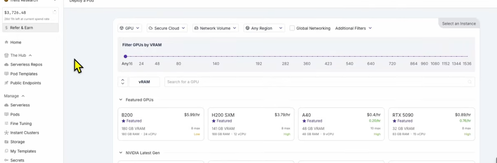
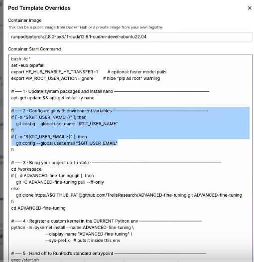
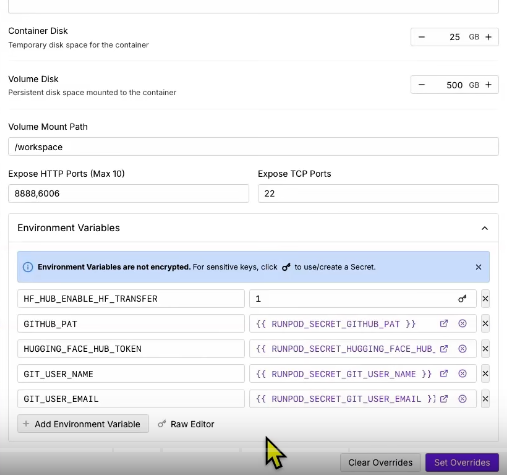
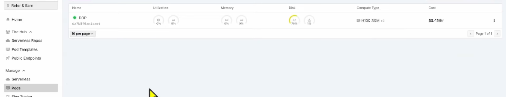
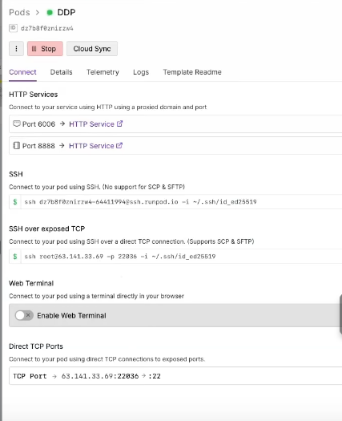
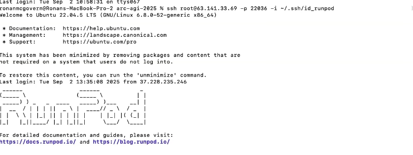

# 🏗️ RunPod Instance Setup & Configuration Guide

> Complete guide for setting up RunPod GPU instances for multi-GPU LLM training

## 📋 Quick Setup Checklist

- [ ] RunPod account created and payment method added
- [ ] SSH key generated and added to RunPod
- [ ] GPU instance selected and launched
- [ ] SSH connection established
- [ ] Environment dependencies installed
- [ ] Multi-GPU configuration completed

## 🚀 Step 1: RunPod Account Setup

### Create Account
1. Visit [RunPod.io](https://runpod.io) and sign up
2. Add payment method (credit card required)
3. Verify email address
4. Complete profile setup

### Generate SSH Key (if you don't have one)
```bash
# On your local machine
ssh-keygen -t rsa -b 4096 -C "your-email@example.com"
cat ~/.ssh/id_rsa.pub  # Copy this to RunPod
```

### Add SSH Key to RunPod
1. Go to **Settings** → **SSH Keys**
2. Click **Add SSH Key**
3. Paste your public key content
4. Name it (e.g., "My Development Key")

## 🎯 Step 2: Instance Selection Guide

### Available GPU Options

*Figure 1: RunPod GPU marketplace showing available instances*

### Recommended Configurations

| Use Case | GPU Config | Cost/Hour | Memory | Best For |
|----------|------------|-----------|--------|----------|
| **Development** | 1x RTX 4090 | $0.50 | 24GB | Testing, debugging |
| **Small Training** | 1x A6000 | $0.80 | 48GB | Models <7B |
| **Production** | 2x A6000 | $1.60 | 96GB | Models 7B-13B |
| **Enterprise** | 4x A100 | $3.20 | 320GB | Models >13B |

### Instance Configuration Process

*Figure 2: RunPod instance configuration page*

1. **Navigate to Pods** → **GPU Pods**
2. **Filter by requirements**:
   - GPU Count: 2 (for dual-GPU setup)
   - GPU Memory: ≥24GB per GPU
   - vCPU: ≥8 cores
   - RAM: ≥32GB
3. **Select template**: PyTorch (recommended)
4. **Choose region**: Closest to your location
5. **Configure storage**: 50GB minimum

## 🔧 Step 3: Launch & Connect

### Environment Variables Setup

*Figure 3: Setting up environment variables in RunPod*

### Launch Instance
```bash
# Example configuration
GPU: 2x RTX A6000 (48GB each)
CPU: 16 vCPUs
RAM: 64GB
Storage: 100GB SSD
Template: PyTorch 2.0
```

### Running GPU Instance

*Figure 4: RunPod instance running with GPU resources*

### SSH Connection Setup

*Figure 5: RunPod SSH connection details*

```bash
# RunPod will provide connection details
ssh root@<pod-ip> -p <port>

# Example:
ssh root@194.68.245.123 -p 22067
```

### Successful Connection

*Figure 6: Successfully connected to RunPod instance*

### Verify GPU Setup
```bash
# Check GPU availability
nvidia-smi

# Expected output for 2x A6000:
# +-----------------------------------------------------------------------------+
# | NVIDIA-SMI 525.105.17   Driver Version: 525.105.17   CUDA Version: 12.0  |
# |-------------------------------+----------------------+----------------------+
# |   0  NVIDIA RTX A6000    Off  | 00000000:05:00.0 On |                  Off |
# |   1  NVIDIA RTX A6000    Off  | 00000000:06:00.0 On |                  Off |
```

## 📦 Step 4: Environment Setup

### Install Dependencies
```bash
# Update system
apt update && apt upgrade -y

# Install required packages
apt install -y git htop vim tmux

# Install Python dependencies
pip install --upgrade pip
pip install torch torchvision torchaudio --index-url https://download.pytorch.org/whl/cu118
pip install transformers accelerate datasets tokenizers
pip install unsloth[colab-new] @ git+https://github.com/unslothai/unsloth.git
pip install tensorboard wandb
```

### Clone Project Repository
```bash
# Clone your project
git clone <your-repository-url>
cd multigpu_training

# Make scripts executable
chmod +x scripts/*.sh

# Run setup script
./scripts/setup_environment.sh
```

## ⚙️ Step 5: Multi-GPU Configuration

### Accelerate Configuration

*Figure 7: Accelerate configuration for multi-GPU setup*

### Configure Accelerate
```bash
# Run accelerate configuration
accelerate config

# Answer prompts:
# - This machine: Yes
# - Distributed training: multi-GPU
# - How many machines: 1
# - Number of GPUs: 2 (or your GPU count)
# - Mixed precision: bf16
# - Use DeepSpeed: No (for now)
```

### GPU Training in Action

*Figure 8: Multi-GPU training in progress with real-time metrics*

### Verify Configuration
```bash
# Test multi-GPU setup
python -c "
import torch
print(f'CUDA available: {torch.cuda.is_available()}')
print(f'GPU count: {torch.cuda.device_count()}')
for i in range(torch.cuda.device_count()):
    print(f'GPU {i}: {torch.cuda.get_device_name(i)}')
"
```

## 🐳 Step 6: Containerization (Optional)

### Docker Setup
```bash
# Install Docker
curl -fsSL https://get.docker.com -o get-docker.sh
sh get-docker.sh

# Install NVIDIA Container Toolkit
distribution=$(. /etc/os-release;echo $ID$VERSION_ID) \
   && curl -s -L https://nvidia.github.io/nvidia-docker/gpgkey | apt-key add - \
   && curl -s -L https://nvidia.github.io/nvidia-docker/$distribution/nvidia-docker.list | tee /etc/apt/sources.list.d/nvidia-docker.list

apt update && apt install -y nvidia-docker2
systemctl restart docker
```

### Build Container
```bash
# Build training container
docker build -t multigpu-training ./containers/

# Run with GPU support
docker run --gpus all -it multigpu-training bash
```

## 🔍 Step 7: Validation & Testing

### Test Single GPU Training
```bash
# Quick single GPU test
python src/main.py --config configs/single_gpu.yaml --epochs 1 --test-mode
```

### Test Multi-GPU Training
```bash
# Clean cache first
./scripts/cleanup_cache.sh

# Test multi-GPU setup
accelerate launch --config_file accelerate_config.yaml \
  src/main.py --config configs/dual_gpu.yaml --epochs 1 --test-mode
```

### Monitor Resource Usage
```bash
# Install monitoring tools
pip install gpustat

# Monitor in real-time
watch -n 1 'gpustat; echo ""; free -h; echo ""; df -h'
```

## 🔧 Troubleshooting

### Common Issues

#### 1. SSH Connection Failed
```bash
# Check if instance is running
# Verify port number in RunPod console
# Ensure SSH key is properly added
```

#### 2. CUDA Out of Memory
```bash
# Reduce batch size in config
# Enable gradient checkpointing
# Use mixed precision training
```

#### 3. Multi-GPU Not Detected
```bash
# Verify NVIDIA driver
nvidia-smi

# Check accelerate config
accelerate env

# Recreate accelerate config
rm ~/.cache/huggingface/accelerate/default_config.yaml
accelerate config
```

#### 4. Unsloth Import Error
```bash
# Reinstall Unsloth
pip uninstall unsloth -y
pip install "unsloth[colab-new] @ git+https://github.com/unslothai/unsloth.git"
```

## 💰 Cost Management

### Auto-shutdown Script
```bash
# Create auto-shutdown script
cat > auto_shutdown.sh << 'EOF'
#!/bin/bash
# Auto shutdown after 4 hours of inactivity
timeout 14400 tail -f /dev/null && shutdown -h now
EOF

chmod +x auto_shutdown.sh
nohup ./auto_shutdown.sh &
```

### Resource Monitoring
```bash
# Set up cost alerts
echo "*/10 * * * * /usr/bin/python3 /root/scripts/cost_monitor.py" | crontab -
```

## 📊 Performance Optimization

### Network Configuration
```bash
# Optimize network for multi-GPU
echo 'net.core.rmem_max = 134217728' >> /etc/sysctl.conf
echo 'net.core.wmem_max = 134217728' >> /etc/sysctl.conf
sysctl -p
```

### Storage Optimization
```bash
# Use fast storage for datasets
mkdir -p /tmp/datasets
# Move datasets to /tmp for faster I/O
```

## 🆘 Support Resources

- **RunPod Documentation**: https://docs.runpod.io
- **RunPod Discord**: https://discord.gg/runpod
- **PyTorch Distributed**: https://pytorch.org/docs/stable/distributed.html
- **Accelerate Documentation**: https://huggingface.co/docs/accelerate

---

*This guide provides enterprise-grade setup procedures for production multi-GPU training environments.*